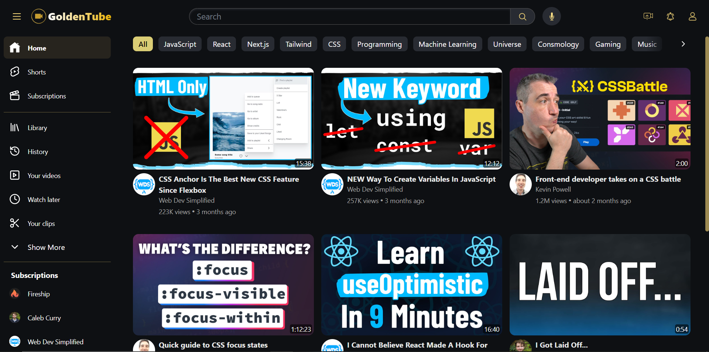

# YouTube Clone GoldenTube



## About The Project

This project serves as a demonstration of YouTube's functionality and user experience. The goal is to provide insights into various layouts and features employed by YouTube. Through this clone, users can explore and gain a deeper understanding of the design and functionalities that make YouTube a widely-used video-sharing platform. Whether you are interested in the intricacies of layout design or the implementation of specific features, this project aims to offer a valuable learning experience. Please note that this is a non-commercial educational project created solely for demonstrative purposes and is not affiliated with or endorsed by YouTube.

# Getting Started

## Requirements

- [git](https://git-scm.com/book/en/v2/Getting-Started-Installing-Git)
  - You'll know you did it right if you can run `git --version` and you see a response like `git version x.x.x`
- [Nodejs](https://nodejs.org/en/)
  - You'll know you've installed nodejs right if you can run:
    - `node --version` and get an ouput like: `vx.x.x`
- [Vite](https://vitejs.dev/)
  - You can now create a new React application by typing:
    - ` npm create vite@latest`

# Built With

- [Node.js](https://nodejs.org/en/)
- [TypeScript](https://www.typescriptlang.org/)
- [Tailwind](https://tailwindcss.com/)

## Quickstart

Clone this repo

```
git clone https://github.com/vaasanthk/golden-tube.git
cd golden-tube
npm i
npm run dev
```

You should see a link in the terminal to launch the application in your browser.

OR Press letter O to launch.

# Thank you!
